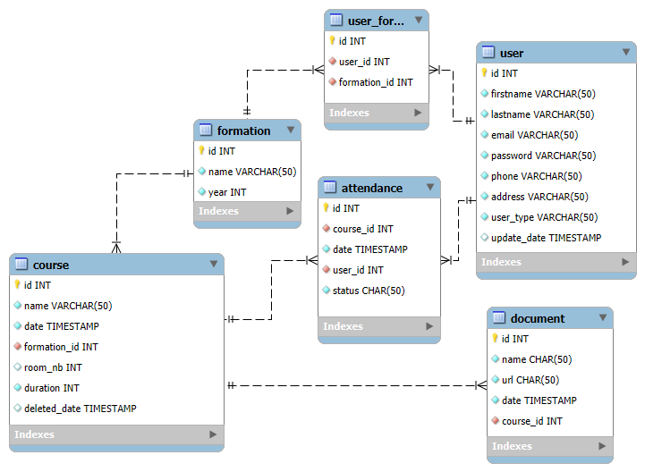

# PAB

## Schéma de la base de données

## Mapping ORM (Exemple pour la classe `User`)

On utilise JPA dans le code afin d'effectuer le mapping entre la 
base de données et les classes entités.
JPA fournit plusieurs annotations pour mapper les classes et les champs aux tables et colonnes de la base de données. Voici quelques-unes des annotations utilisées :
- @Entity : Indique que la classe est une entité JPA.
- @Table : Spécifie le nom de la table de base de données.
- @Id : Indique le champ qui est la clé primaire.
- @Column : Spécifie le nom de la colonne de base de données.

La classe `User` est mappée à la table `user` dans la base de données avec les champs suivants :

- `id` : Clé primaire avec génération automatique.
- `firstname`, `lastname`, `email` etc. : Champs de l'utilisateur.
- Relation `@ManyToOne` avec la classe `Formation`.

Relation `@ManyToOne` :

